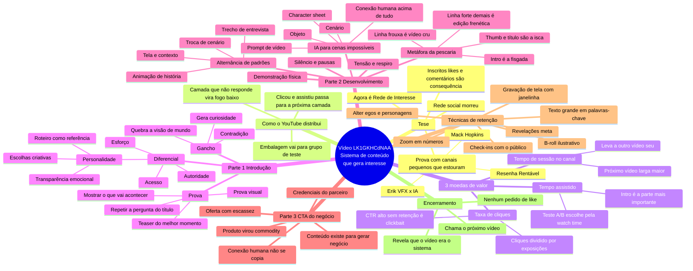

# Mapa mental: "Você não faz ideia como o YouTube funciona"

Cole o bloco abaixo em qualquer visualizador de Mermaid (GitHub, mermaid.live, Obsidian, Notion).

```mermaid
mindmap
  root((Vídeo LK1GKHCdNAA<br/>Sistema de conteúdo<br/>que gera interesse))
    Tese
      Rede social morreu
      Agora é Rede de Interesse
      Inscritos likes e comentários são consequência
      Prova com canais pequenos que estouram
        Resenha Rentável
        Erik VFX x IA
        Mack Hopkins
    Como o YouTube distribui
      Embalagem vai para grupo de teste
      Clicou e assistiu passa para a próxima camada
      Camada que não responde vira fogo baixo
    3 moedas de valor
      Taxa de cliques
        Cliques dividido por exposições
        CTR alto sem retenção é clickbait
      Tempo assistido
        Teste A/B escolhe pela watch time
        Intro é a parte mais importante
      Tempo de sessão no canal
        Leva a outro vídeo seu
        Próximo vídeo larga maior
    Parte 1 Introdução
      Gancho
        Contradição
        Quebra a visão de mundo
        Gera curiosidade
      Prova
        Repetir a pergunta do título
        Prova visual
        Mostrar o que vai acontecer
        Teaser do melhor momento
      Diferencial
        Esforço
        Autoridade
        Acesso
        Personalidade
          Transparência emocional
          Escolhas criativas
          Roteiro como referência
    Parte 2 Desenvolvimento
      Metáfora da pescaria
        Thumb e título são a isca
        Intro é a fisgada
        Linha frouxa é vídeo cru
        Linha forte demais é edição frenética
      Alternância de padrões
        Troca de cenário
        Tela e contexto
        Animação de história
        Trecho de entrevista
      Silêncio e pausas
      Tensão e respiro
      Demonstração física
      IA para cenas impossíveis
        Character sheet
        Cenário
        Objeto
        Prompt de vídeo
        Conexão humana acima de tudo
    Parte 3 CTA do negócio
      Conteúdo existe para gerar negócio
      Produto virou commodity
      Conexão humana não se copia
      Credenciais do parceiro
      Oferta com escassez
    Técnicas de retenção
      Alter egos e personagens
      Gravação de tela com janelinha
      Texto grande em palavras-chave
      Zoom em números
      B-roll ilustrativo
      Check-ins com o público
      Revelações meta
    Encerramento
      Revela que o vídeo era o sistema
      Chama o próximo vídeo
      Nenhum pedido de like
```
